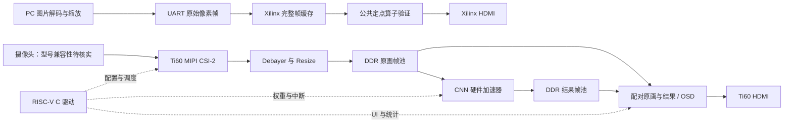

# 赛题一实施计划

更新：2026-10-07。依据：根目录《易灵思.pdf》第 3–7 页、两平台现有项目与 Ti60F225 V4 板卡设计说明。当前阶段为资料审阅与规划，尚未重新综合、仿真或上板。

用户补充：实际器件为 `xc7k325tffg676-2`、`Ti60F225`，摄像头型号为 `SC432HAI`；彩条实验通过调整分辨率与 PLL 可以实现 720p，原配置只能实现其所称的“1k”。这是已有上板反馈，具体平台、标准刷新率、修改后的文件与“1k”的精确尺寸仍待核对。摄像头与资料的 SC431HAI 型号不同，需要在 P0 核实兼容性。

## 1. 项目定位

最终作品按赛题要求落在 Ti60F225I3 上的摄像头实时风格化系统（用户已确认 Ti60F225，实物速度等级待核对）。Xilinx 工程按用户的硬件条件，通过 PC 串口输入图片，验证 HDMI 显示、图像处理和公共神经网络算子。两条路线共用图像约定与定点算法，分别实现厂商相关接口。

第一题不能仅以“摄像头直通 HDMI”结束，也不能用传统滤镜代替神经网络。实施顺序是：先让图像链路可靠工作，同时建立小模型的软件参考，然后做算子、总线和软核集成。

## 2. 已阅览文件与现状

| 内容 | 实际入口（相对工作区根目录） | 已确认信息与用途 |
| --- | --- | --- |
| 赛题 | `易灵思.pdf` | 2026 年选题指南；第一题要求 MIPI、DDR、轻量网络加速、RISC-V、HDMI 与 FPS |
| Xilinx HDMI | `xilinx/xc7k325tffg资料/hdmi/prj/hdmi_test/hdmi_test.xpr` | Vivado 2023.2 保存工程；器件 xc7k325tffg676-2；顶层 hdmi_top |
| Xilinx 视频源 | `xilinx/xc7k325tffg资料/hdmi/rtl/` | hdmi_driver、hdmi_disp、TMDS 编码和 OSERDESE2 串化；当前为内部图案源，无 UART 图像输入 |
| Xilinx 时钟/引脚 | 上述工程的 `hdmi_test.srcs/`；`xilinx/xc7k325tffg资料/资料/引脚分配的常用约束文件/uart_eco.xdc` | HDMI 输入 50MHz，PLL 输出 75/375MHz；UART 示例 RX=B20、TX=C22，与提供的原理图文字一致；uart_eco.xdc 同时包含 ILA 网表约束，不能整份盲用 |
| 易灵思摄像头主参考 | `elinx/elinxdemo/Ti60F225_DemoBoard_v4/10_Ti60f225_sc431hai2hdmi_demo/Ti60f225_sc431hai2hdmi_v1/ti60f225_oob.xml` | Efinity 2025.2.288.3.8 保存工程；Ti60F225/I3；顶层 rtl/ti60f225_oob_top.v |
| 易灵思 HDMI 单独参考 | `elinx/elinxdemo/Ti60F225_DemoBoard_v4/03_hdmi_tx_demo/hdmi_tx_demo_v2/rtl/top.v` | TMDS 输出经外设接口配置；当前参数含 1920×1536，不能将目录名当作标准 720p60 配置 |
| 易灵思 UART | `elinx/elinxdemo/Ti60F225_DemoBoard_v4/17_Ti60F225_uart_demo/17_Ti60F225_uart_demo/src/top.v` | 27MHz、115200 波特率、FIFO 回显示例；后续可用于控制命令 |
| 易灵思软核 | `elinx/elinxdemo/Ti60F225_DemoBoard_v4/08_ti60f225_soc_demo/` | hardjtag/co_debug 子工程、DDR/SoC RTL 与 embedded_sw 示例，可作为 C 驱动集成起点 |
| 板卡说明 | `elinx/elinxdemo/Ti60F225_DemoBoard_v4/TI60F225I3-V4 DEMO板软硬件设计说明-260924.pdf` | 包含多个新版示例修订记录；与目录里的 v1 工程不完全相同，必须建立实际版本基线 |

审阅重点为赛题和上述工程入口、关键 RTL、时钟/IP 参数、约束及相关说明；没有逐行审查全部安装包、生成网表或全部示例。

### 现有工程与赛题的关键差距

1. Xilinx 的 `hdmi_top.sv` 目前连接 `hdmi_disp` 图案发生器，没有 UART、帧协议或图像帧缓存；后续应替换/扩展像素源。
2. Xilinx `hdmi_driver.sv` 是 1650×750 总时序、1280×720 有效区；75MHz 对应约 60.606Hz。标准 720p60 应核对 74.25MHz、同步极性和 5 倍串化时钟 371.25MHz。新建工程中调整，保留原示例。
3. 易灵思摄像头顶层把四个 RAW10 像素截取高 8 位后写入 DDR，读出后进入 `debayer_top_2to1`，输出每拍两个 RGB 像素；这不是已完成的“640×480 RGB 预处理帧入 DDR”路线。
4. 实际摄像头实例参数为 `FB_NUM=3`，源码也支持 2 帧/3 帧模式。应验证其仲裁、完整帧语义与输入/显示异步速率，不能只改参数便宣称满足赛题双缓冲。
5. 主摄像头工程存在 Sapphire IP 目录，但顶层未见 Sapphire 实例；相机初始化当前由 RTL I2C 控制模块完成。该摄像头示例目录未查到 C 源文件，readme 中的软件路径属于旧参考，不能据此认为 RISC-V 功能已经集成。
6. 主摄像头工程还含 DSI 和非标准显示参数；顶层 HDMI 连接中有 R/B 和 HS/VS 交叉。板卡说明也记录了相关版本修正，应先测色序/同步并核对 IP 接口，再在独立工程中调整。
7. 尚无已识别的风格迁移模型、训练权重、量化参考、CNN 加速器、算子对照或实时性能报告。

## 3. 赛题验收表

| 基础项 | 目标 | 验收证据 |
| --- | --- | --- |
| 摄像头 | SC431HAI/MIPI CSI-2 接入、RAW 转 RGB、Resize，至少 640×480@30fps | 寄存器读回、有效尺寸/帧编号、采集 FPS、协议错误/溢出计数、画面颜色 |
| 帧缓存 | 预处理帧进入 DDR，双缓冲完整帧交接 | 地址与 stride 表、状态机/所有权验证、读写压力测试、无覆盖/撕裂证据 |
| 网络算子 | 3×3 或 5×5 卷积、激活、BN 或 IN 硬件近似 | 结构/权重来源、定点定义、逐层软件对照、RTL 波形、综合资源 |
| 总线 | 经系统总线读图像块、计算、结果回写 DDR | AXI/等效总线事务、背压测试、DMA 完成与错误处理 |
| RISC-V | 摄像头配置、加载权重、任务调度/中断、UI 配置 | C 驱动、寄存器映射、可复现启动日志 |
| HDMI | 标准 720p60 或 1080p30；原画与风格画对比/切换 | 时钟/时序表、显示器识别、同步画面、稳定性视频 |
| 性能 | 640×480 推理稳定超过 15fps，并叠加 FPS | 硬件完成帧计数、测试时长、延迟统计；目标留余量，争取 30fps |

30fps 采集、超过 15fps 推理、60Hz 显示是三个指标。若每个采集帧都要推理且长期运行不积压，推理吞吐必须达到输入速率；有限帧缓存无法永久吸收 30→15fps 的差额。基础开发时可独立量测 15fps 以上推理，但最终以接近/达到 30fps 为工程目标；若使用选帧策略，必须如实报告，并核实“确保数据流不丢帧”的验收口径。显示重复上一张完整结果帧不增加推理 FPS。

## 4. 两条路线和共用接口

建议内部统一为 RGB888，明确定义 R/G/B 字节顺序；CNN 输入/权重采用有符号 INT8 候选、累加采用足够位宽（起步 INT32），输出重新量化/饱和。UART 首个版本可传 RGB565，接收后统一转换成 RGB888。最终像素和量化约定在实现前写入接口文档，不让两个平台各自猜测。

720p 对比显示可将两张 640×480 图像按 1:1 并排放入 1280×720，有效图像上下各留 120 行用于标题和统计。避免最初就加入复杂全屏缩放。对比图像必须来自同一帧，必要时单独保存与结果关联的原图。

## 5. 串口方案的边界

按 UART 8N1，每字节消耗 10 个串行 bit，理想像素字节率为 `baud/10`，未含协议、USB/驱动等待和重传。

| 图片 | 像素字节数 | 115200 波特率理想耗时 | 921600 波特率理想耗时 |
| --- | ---: | ---: | ---: |
| 160×120 RGB565 | 38,400 | 3.33s | 0.417s |
| 320×240 RGB565 | 153,600 | 13.33s | 1.667s |
| 640×480 RGB565 | 614,400 | 53.33s | 6.667s |
| 640×480 RGB888 | 921,600 | 80.00s | 10.00s |

640×480 RGB565 的 30fps 传输至少需要 184.32Mbps UART 线速（尚未含额外开销）。因此先做 160×120 或 320×240 静态传图，HDMI 以 60Hz 刷新缓存。波特率先用 115200 验证，921600 及以上以实际 USB-UART 芯片、驱动和误码测量为准。

建议协议内容：magic、version、frame_id、width、height、pixel_format、payload_len、header_check、payload、CRC32。先定义字段长度/字节序/CRC 参数和最大尺寸，头部合法后按确定长度取 payload，不能用像素中的 magic 作为无条件重同步标记。起步使用完整帧停等 ACK/NACK、超时、有限重试；FPGA 只在完整帧校验成功后发布。前后台缓存均预算资源；若 BRAM 双缓冲不够，再加入 DDR，不在第一步就绑定复杂 DDR 控制器。

## 6. 实施步骤与验收门槛

| 阶段 | 主要工作 | 通过标准/交付物 | 前置 |
| --- | --- | --- | --- |
| P0 硬件与环境基线 | 核实两块板、摄像头/子卡、电源/接口；记录 Vivado、Efinity、RISC-V IDE 与 IP 版本；确认工程依赖，建立独立开发目录 | 板卡/软件清单、工程入口和依赖表；示例重建结果；待确认项关闭或注明 | 当前 |
| P1 两平台显示基线 | 复现 HDMI 彩条；核对 PLL、标准 720p60、色序、同步、数据读取延迟；Ti60 验证 DDR 校准 | 显示器识别 720p60；彩条/棋盘/首末像素正确，连续运行无闪屏；记录时序与资源 | P0 |
| P2 Xilinx UART→HDMI | UART 回显→帧协议→PC 发送工具→小图 BRAM 前后台缓存→帧边界换帧 | 与输入图片逐像素/校验一致；半帧、CRC 错、超时后可恢复；连续换图无撕裂 | P1 Xilinx |
| P3 Ti60 摄像头→RGB→DDR→HDMI | 先复现现有摄像头示例，再改为 RAW 解包/Debayer/Resize→640×480 RGB 缓冲；检查 30fps 与标准显示 | 彩色/纹理/运动场景正确；640×480@30fps 采集与预处理计数；缓冲交接/溢出记录 | P1 Ti60 |
| P4 小模型与定点参考 | 按 Ti60 资源选择微型 CNN；训练单风格、评估画质、INT8 量化；导出权重、偏置、量化尺度和逐层样本 | 浮点/定点输出和误差报告；结构、MAC、特征缓存、参数量预算；有效风格效果 | P0 起可开展，算子接口须先定 |
| P5 公共 CNN 算子 | 3×3 窗口/行缓存→多通道 MAC→归一化仿射→ReLU→重定标/饱和；先单层，再多层 | Python 定点参考与 RTL 一致；边界/符号/溢出/背压验证；分别综合两平台并记录资源 | P4；Xilinx 展示依赖 P2 |
| P6 Ti60 总线与 RISC-V | DDR 多主仲裁、DMA、帧池、加速器控制寄存器/IRQ；整合 Sapphire；C 端接管摄像头、权重、启动/完成/错误及 UI 配置 | C 驱动完成一次输入→推理→回写；原图/结果正确配对；总线背压与缓存一致性通过 | P3、P5；软核起步可提前 |
| P7 实时闭环与 FPS | 输入/结果缓冲与对比 OSD、硬件 FPS/延迟统计；优化 MAC 并行度和层间缓存；整机测试 | 640×480 推理稳定超过 15fps，争取 30fps；720p60 输出；计数无隐藏丢帧，持续运行记录 | P6 |
| P8 提交与高阶功能 | 基础验收逐项复核，准备架构图、资源/时序/画质/性能报告、操作说明和展示视频；再加入 ≥2 风格、<100ms 切换或 720p 处理 | 可复现构建、权重与软件配套，基础检查全通过；高阶实测单独报告 | P7 |

P1–P3 保证硬件链路；P4 早启动，避免等摄像头完成后才发现网络规模或画质不可用。若由一人推进，建议先完成 Xilinx 小图显示的最小闭环，随后尽早复现 Ti60 摄像头例程。不要把所有算法验证都放在 Xilinx 结束后才验证 Ti60 资源。

### P2 建议模块

`uart_rx` → `image_packet_rx` → `frame_write` → `frame_store` → `display_read` → 已有 HDMI 输出封装。配套 PC 工具负责解码、缩放、打包、串口发送和 ACK/错误报告。公共卷积插入原图缓存与显示之间，保留 bypass 便于定位问题。

### P3/P6 帧池与总线

起步区分采集帧池和结果帧池：采集至少双缓冲，结果至少双缓冲；在原画/结果同时显示时额外解决原图保留与配对。每帧记录 `frame_id`、地址、有效尺寸、stride、状态及引用计数/所有权。明确 `FREE → CAPTURING → READY → INFER_READING` 与 `FREE → INFER_WRITING → READY → DISPLAY_READING` 的转换和释放条件。不能用四个地址代替真正的同步/仲裁设计。

DDR 访问优先保障不可暂停的采集写入和 HDMI 读出；推理通过 ready/valid 背压调节。任务完成必须等待最后写响应，显示切换必须在垂直消隐握手完成后进行。Sapphire 若启用数据缓存，DMA 交接需 clean/invalidate 或采用已确认的非缓存映射；`volatile` 不能解决缓存一致性。

## 7. 初始模型与资源预算

先评估一个仅作候选的网络：三层 3×3 卷积，通道 `3→8→8→3`，前两层带归一化和 ReLU，末层按输出约定裁剪/重定标。是否使用残差、增加通道或下采样，应由训练画质和 Ti60 预算决定，当前不冻结网络，也不保证该最小网络达到预期艺术效果。

- 三层共 `9×(3×8+8×8+8×3)=1008` MAC/像素；640×480 每帧约 3.097 亿 MAC。
- 15fps 需要约 4.645GMAC/s，30fps 需要约 9.290GMAC/s，未含 padding、搬运、归一化和控制开销。
- 例如 64 个 MAC lane 在 150MHz、70% 有效利用率时约 6.72GMAC/s，只是预算假设；lane 不等于一块 DSP，必须看映射和时序。不能将理论峰值当作已测 FPS。
- Ti60 厂商规格列出 160 个 DSP；MIPI、DDR、软核和其他模块也占用资源，须用同一最终工程的综合报告划分预算。
- 单张 640×480 RGB888 帧为 921,600B；输入和结果各双缓冲约 3,686,400B，尚未包含配对原图、stride 对齐、模型和中间特征。
- 单层 8 通道 INT8 的整帧特征为 2,457,600B。优先行缓存、分块和层间融合，避免多层全帧反复写 DDR；分块需保留 3×3 卷积的 halo，防止块边界接缝。
- 按 RGB888、30fps 输入与推理、720p60 中左右各显示 640×480 的原图/结果粗算：采集写约 27.65MB/s、推理读写约 55.30MB/s、两图显示读约 110.59MB/s，合计约 193.54MB/s。此为有效像素下限，未含特征访问/突发低效/重读/刷新，须量测实际 DDR 吞吐。显示读取若缓存复用，预算另算。

归一化建议先选择推理时固定统计量的 BN：`y=a×x+b`，导出每通道 a/b，硬件做定点乘加和重定标，并记录与原浮点 BN 的误差。后续可评估折叠到卷积，但需要保留等价关系与验收说明。IN 的均值/方差依赖当前图像，不能直接当作固定 BN 处理。

训练用 PC 可以使用现成工具和教师网络，但 FPGA 端必须执行部署模型推理。随机权重、手写滤镜和仅加载预先处理好的结果图都只能证明链路/运算，不能作为最终风格化 Demo。

## 8. 当前待确认事项

| 项目 | 当前已知 | 下一次实现前的动作 |
| --- | --- | --- |
| 实际 Xilinx 板卡 | 用户确认 xc7k325tffg676-2 | 继续核对板卡版本、晶振、USB-UART 与 HDMI 引脚 |
| 实际易灵思板卡 | 用户确认 Ti60F225；资料为 V4 / I3 | 核对实物版本/速度等级、MIPI 子卡和对应供电设置，不依据其他官方开发套件猜引脚 |
| 摄像头 | 用户提供 SC432HAI，赛题/示例为 SC431HAI | 核实实物标注、寄存器表、CSI lane/RAW 格式及兼容性；不能直接沿用初始化表 |
| 已成功上板的示例 | 用户反馈彩条原配置可显示“1k”，配套修改分辨率/PLL 后可显示 720p | 核对是哪块板、准确尺寸/刷新率、修改后的工程；继续确认 Ti60 摄像头/DDR 与串口可用性 |
| 工具 | PATH 查到 Python、Poppler、Icarus、Git；未查到 vivado/efinity 命令 | 确认安装位置、许可证及 GUI/CLI 可用性；PATH 未找到不等于未安装 |
| 模型/风格 | 未发现已识别的模型训练产物 | 先确定一个目标风格和小样本画质，再选择最终结构 |
| 时间安排 | 未提供团队人数、已有经验和提交日期 | 按上述里程碑排期，暂不编造日程/工期 |

## 9. 下一步具体工作

第一项实施工作是 P0/P1：核对实际板卡与用户已成功的彩条配置，建立 Xilinx 独立 HDMI 工程，固定标准 720p60 的时序和 PLL，保留可复现基线；随后进入 P2 的小图 UART 传输。Ti60 在确认用户 SC432HAI 与 SC431HAI 示例的兼容性后，尽早重建并验证摄像头→DDR→HDMI 路径。模型软件参考应在基础链路开发期间启动。

本轮仅新增根目录 `AGENTS.md` 和本文，未调整示例 RTL、XDC/SDC、IP 或板卡配置。后续每个阶段应在本文或单独验证记录中写清“已完成/未完成、运行命令、结果与剩余问题”。

## 参考来源

- 本地《易灵思.pdf》：赛题一和平台要求，依据为第 3–7 页。
- 本地 Ti60F225 V4 板卡软硬件设计说明：摄像头示例章节及版本记录；引脚、电压与操作以实物对应版本为准。
- [AMD UG934：640×480p60 至 720p60 视频缩放示例](https://docs.amd.com/r/en-US/ug934_axi_videoIP/Up-scaling-Live-External-Video)：720p60 像素时钟 74.25MHz。
- [Efinix Ti60 器件规格](https://www.efinixinc.com/shop/ti60.php)：Ti60 DSP 资源规格；不替代本地开发板原理图。
- [Efinix Sapphire RV32 SoC 特性与资源示例](https://www.efinixinc.com/docs-html/rv32-sapphire-ds/topics/riscv-saxon-efx-features-sapphire.html)：软核资源占用因配置而变化；文档示例平台/速度等级不直接代表本工作区 I3 工程性能。
